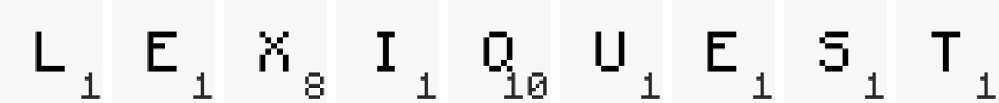

Your favorite word board game in Minecraft.

You can watch the video trailer [here](https://www.youtube.com/watch?v=uMO5CfCpZig).

---

This repository is for the data pack used in LexiQuest, and doesn't work on its own.

You can however [download](https://github.com/TriLinder/LexiQuest/releases/latest/download/LexiQuest.zip) the full map under the releases tab.

Made for Minecraft version 1.20.2 and higher.
